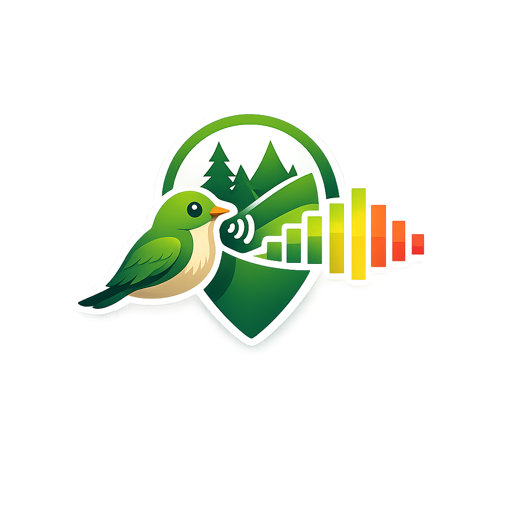
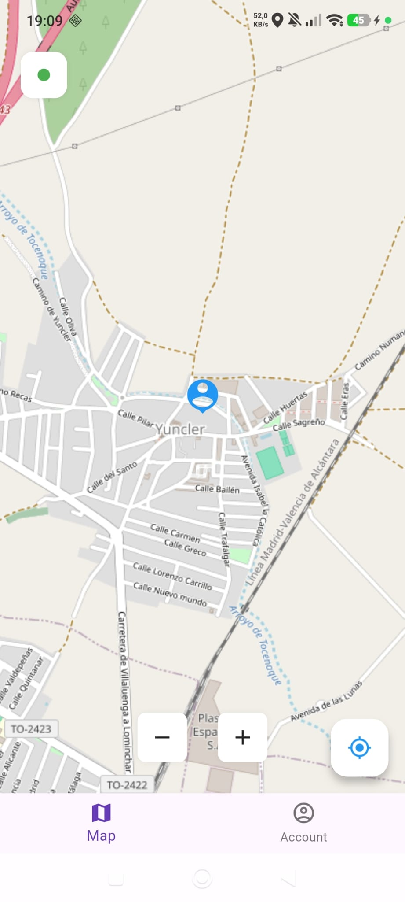
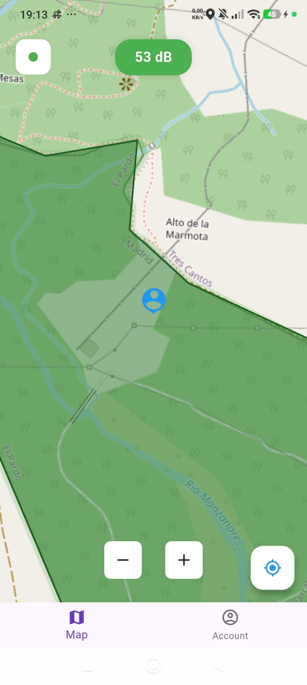
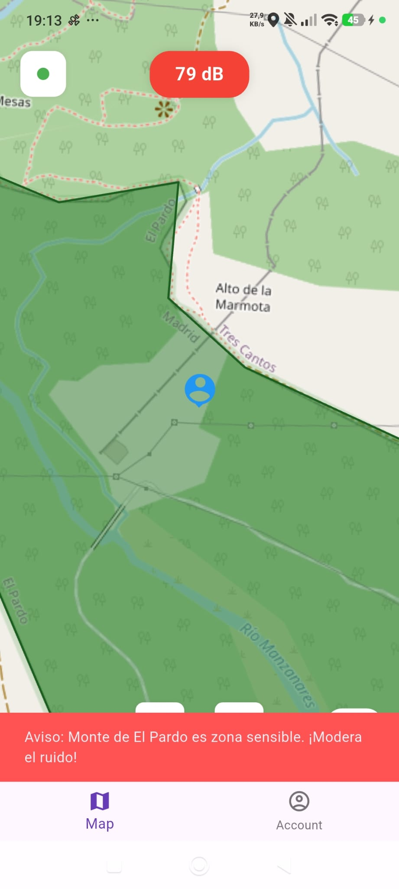
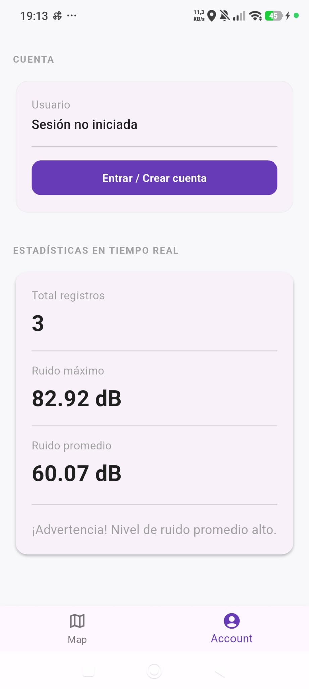
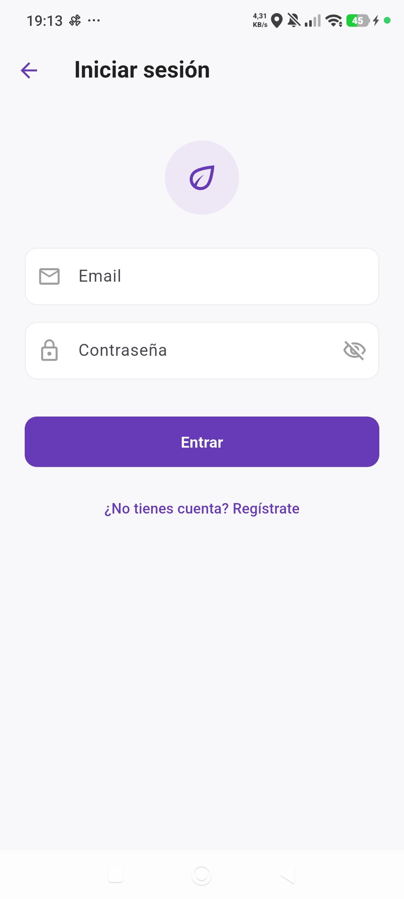
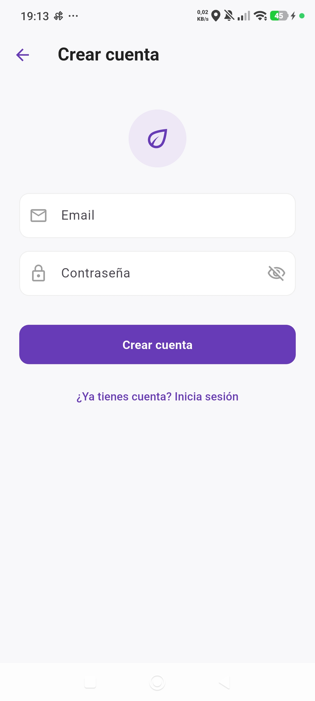
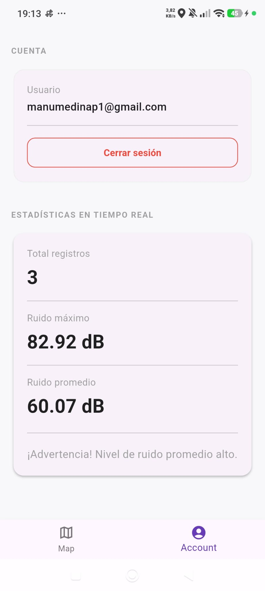
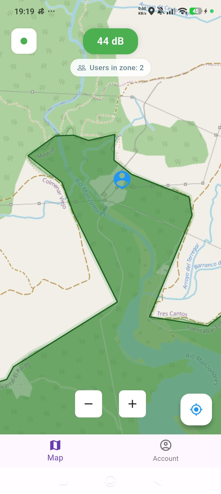

   
   <h1><b>BioQuiet Cross</b></h1>
   
<i>~ Protege la naturaleza, controla tu ruido ~</i>

   

      <a href="https://github.com/StafLoker/bioquiet-backend">Backend</a>
   

   
Aplicación Multiplataforma (desarrollada con Flutter) para monitorizar el nivel de ruido en Zonas de Especial Protección para las Aves (ZEPA). Avisa al usuario cuando supera los umbrales de ruido permitidos para proteger la fauna local.

   

---

# Features

- **[NUEVO]** Inicio de sesión/Registro con Firebase Authentication (Email y Google).
- **[NUEVO]** Contador dinámico en tiempo real sincronizado mediante Firebase Database para ver la afluencia en cada ZEPA.
- **[NUEVO]** Arquitectura refactorizada a MVVM.
- **[NUEVO]** UX fluida con animaciones progresivas en el mapa y persistencia de estado mediante `IndexedStack`.
- **[NUEVO]** Almacenamiento local persistente (CSV) para el histórico de mediciones de ruido.
- **[NUEVO]** Flujo de trabajo CI/CD integrado mediante GitHub Actions.
- Mapa interactivo con las ZEPAs de la zona visible.
- Detección automática de entrada/salida en zonas ZEPA.
- Monitorización del nivel de ruido en tiempo real (dB).
- Alertas visuales (verde / amarillo / rojo) según los umbrales de cada ZEPA.
- Notificación cuando se supera el umbral de advertencia.
- Estadística de ruido generado por usuario (UI Mejorada).

# Tecnologías

- **Frontend**: Flutter & Dart (Desarrollo multiplataforma).
- **Backend**: Firebase (Authentication & Realtime Database).
- **Mapas**: OpenStreetMap con `flutter_map` y `latlong2`.
- **Sensores**: GPS (`geolocator`) y Micrófono (`noise_meter`).
- **Persistencia**: Sistema de archivos local para registros en CSV.

# Como usar

_AVISO: Es necesario tener conexión a internet para cargar el mapa y consultar las zonas ZEPA cercanas._

1. **Instalación:** *(Los instaladores APK estarán disponibles en la sección de Releases de GitHub próximamente)*. Para pruebas locales, clona el repositorio y ejecuta el comando `flutter run` con un dispositivo físico conectado o un emulador configurado.
2. **Permisos:** Al iniciar, concede los permisos de Ubicación y Micrófono para habilitar el mapa y el sensor de ruido.
3. **Inicio de Sesión:** Regístrate o entra con tu cuenta autenticada para activar el contador dinámico de usuarios en cada zona. (Los usuarios invitados tienen ciertas funciones restringidas).
4. **Navegación:** Utiliza el mapa para localizar zonas ZEPA (áreas en verde). Al entrar en una, se activará el monitor de dB y verás cuántas personas más están en la zona.
5. **Estadísticas:** Pulsa en 'Account' para consultar tu histórico persistente de impacto acústico generado.

# Screenshots

<table>
  <tr>
    <td></td>
    <td></td>
    <td></td>
  </tr>
  <tr>
    <td></td>
    <td></td>
    <td></td>
  </tr>
  <tr>
    <td></td>
    <td></td>
    <td></td>
  </tr>
</table>

# Demo Video

No available

---

# Participantes

- _Stefan Oshchypok_ # stefan.oshchypok@alumnos.upm.es
- _Manuel Adrian Mora Medina_ # manuel.mmedina@alumnos.upm.es

Carga de trabajo 50%/50%.